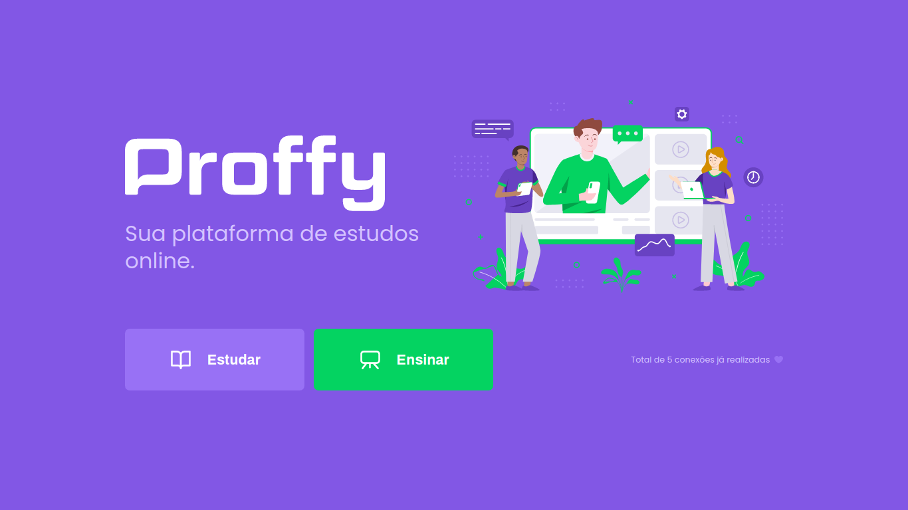

<h1 align="center">
  
</h1>

<h4 align="center"> 
	🚀 NextLevelWeek 2.0 - Proffy
</h4>

  
  

## A Next Level Week

A Next Level Week consiste de um evento prático realizado pela [Rocketseat](https://rocketseat.com.br/), com a finalidade de levar os programadores para o próximo nível por meio de conteúdo aberto para a comunidade.

## Projeto - Proffy

O Proffy é um projeto que busca conectar professores com estudantes.

  

## Tecnologias

O projeto foi desenvolvido com as seguintes tecnologias:
- [Node.js](https://nodejs.org/)
- [Yarn](https://yarnpkg.com/)
- [TypeScript](https://www.typescriptlang.org/)
- [React](https://reactjs.org)
- [React Native](https://facebook.github.io/react-native/)
- [Expo](https://expo.io/)
